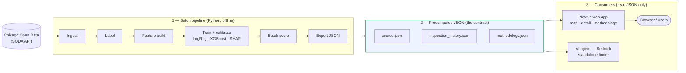

# Food Safety Intelligence — Capstone

Predicting forward-window food-safety risk for Chicago restaurants from public
inspection, business-license, and 311-complaint data. UC Berkeley MIDS capstone.

**Team**: Jun Xu (PM), Arun Agarwal, Bella Davies, Deepak Srivastava, Aurelia Yang

> **Latest status**: see [`docs/weekly/`](docs/weekly/) — newest dated file is
> the current snapshot of what's built, what's open, and how to verify locally.

## What we're building this iteration

1. A measured model (logistic regression baseline → calibrated XGBoost) with
   SHAP explainability.
2. A Next.js web app that runs on a laptop and answers three questions for any
   Chicago restaurant: *Is risk elevated? Improving or worsening? What's driving it?*

See `CLAUDE.md` for the full scope contract.

## System architecture

The system is **two languages joined at a JSON seam**, plus a standalone
conversational agent that reads the same JSON.

1. A **Python batch pipeline** pulls public Chicago data, builds leak-guarded
   features, trains a calibrated model, and scores every establishment.
2. It writes a small set of **precomputed JSON files** — the contract.
3. A **Next.js web app** reads only that JSON. It never calls the model at
   request time. This batch-score-to-JSON pattern is permanent by design.
4. A separate **Strands agent** answers natural-language queries by reading the
   same precomputed JSON (not part of the web request path).

The same code runs on a laptop (local `./data`, JSON bundled in
`app/public/data/`) or on AWS (S3 for data, CloudFront-fronted S3 for the JSON).
The only switch is one env var, `FOODSAFETY_DATA_DIR` — everything routes
through `foodsafety.io.storage`, which abstracts local vs `s3://`.



Flow is one-way, left to right: the model runs on the left, writes the JSON
contract in the middle, and the consumers on the right only read that JSON —
they never call the model. Every pipeline step reads and writes through one
storage layer (`foodsafety.io.storage`), so the same code runs against local
files or S3.

### The three planes

**1. Python pipeline (`src/foodsafety/`, `scripts/`, driven by the `Makefile`).**
Stages run in order — `make data features retrain history`:

| Stage | Entry point | Reads | Writes |
|---|---|---|---|
| Ingest | `scripts/ingest_raw.py` | Chicago SODA API (6 datasets) | `data/raw/*.parquet` |
| Label | `notebooks/01`,`02` → `data/labels.py` | `raw/inspections.parquet` | `processed/inspections_labeled.parquet` |
| Features | `scripts/build_features.py` → `features/build.py` | labeled + raw side-inputs | `processed/features/<name>.parquet` |
| Train + score | `scripts/retrain_baseline_sigmoid.py` | features | model `.joblib` + `predictions/scores.parquet` + `scores.json` + `reports/metrics/*.json` |
| History sidecar | `scripts/export_inspection_history.py` | labeled | `inspection_history.json` |
| Methodology | `scripts/build_methodology_json.py` | features | `methodology.json` |
| Publish (AWS) | `scripts/publish.py` | local artifacts | uploads to `s3://…` |

Discipline baked into the code: chronological train/val/test split only (never
shuffled), every `prior_*` feature uses a `.shift()` / `< as_of_date` leakage
guard, training starts 2019-01-01 (the July 2018 procedure change makes older
labels non-comparable), and class imbalance is handled with weights, never
SMOTE. The feature contract lives in one place, `models/baseline.py::ALL_FEATURES`,
shared by the baseline, XGBoost, scoring, and SHAP so A/B comparisons stay clean.

**2. The JSON seam (`docs/interface_contracts.md` is source of truth).** Three
parquets plus one exported JSON are the only cross-team contract; schema changes
require a PR tagging every owner. `scores.json` (schema 0.4.0) carries the scored
population (~23k establishments: `risk_score`, `risk_tier`, 3–5 SHAP
`top_drivers`, `trend_slope_90d`) plus a single top-level Platt `calibration`
triple the app uses to reconstruct each profile's calibrated-log-odds waterfall.
`inspection_history.json` is a separate sidecar (~47 MB, kept out of the main
payload), and `methodology.json` holds the eval metrics and operating-point
table for the methodology page.

**3. Next.js web app (`app/`, App Router + React 19 + Tailwind 4 + MapLibre).**
Pages are server components; data loads through a server-only stack
(`lib/data-source.ts` → `lib/scores-server.ts` → `lib/methodology-server.ts`).
The fallback chain: remote `scores.json` via `DATA_BASE_URL` → local
`public/data/scores.json` → committed `scores_mock.json` (which flips on a demo
banner). There are **no API routes** — the app reads precomputed JSON only and
never runs the model. Routes: the map home, restaurant detail (gauge + driver
waterfall + inspection timeline), how-it-works (methodology), caregivers, and
sources.

**The agent (`agents/`).** A standalone Strands agent on Amazon Nova 2 Lite
(Bedrock) with three tools — find restaurants (OpenStreetMap/Overpass), score
them (SageMaker endpoint with a local stub, falling back to `scores.json`), and
explain one establishment (SHAP drivers + history from the same JSON). It runs
locally via `agents/run_local.py` or as Lambda-backed AgentCore tools. It is a
separate runtime that happens to read the same precomputed JSON — it is **not**
wired into the web app's request path.

### Local vs AWS — the storage seam

Every pipeline I/O call routes through `src/foodsafety/io/storage.py`, which
resolves a target to a pyarrow filesystem (`LocalFileSystem` or
`S3FileSystem`) based on whether the path starts with `s3://`. So the entire
pipeline runs unchanged in either mode:

- **Local (default):** `FOODSAFETY_DATA_DIR=./data`, JSON written to the
  committed `app/public/data/` bundle, app reads from disk.
- **AWS (Phase 2):** `FOODSAFETY_DATA_DIR=s3://food-safety-intelligence-data`;
  the web JSON lives behind CloudFront and the app fetches it at build/render
  time via `DATA_BASE_URL`. No request-time inference is added — only *where*
  the batch job runs and *where* the JSON lives change.

## Run locally

The repo is two languages joined at a JSON seam: Python builds the model and
writes `scores.parquet`; a script converts that to JSON; Next.js reads it.

### Python (model + data pipeline)

Requires Python 3.11 and [`uv`](https://docs.astral.sh/uv/) (`brew install uv` on macOS).

```bash
git clone <repo> && cd food-safety-intelligence
uv sync --extra dev          # creates .venv, installs deps
uv run nbstripout --install  # one-time: wire the git filter that
                             # strips notebook outputs on commit
git config core.hooksPath .githooks  # one-time: enable the ruff pre-commit hook
cp .env.example .env         # default settings work; edit if needed
```

**Current pipeline state (MVP, 2026-06):** data fetch + feature build run
from notebooks; training + scoring + export are scripted.

```bash
# 1. Data fetch + features (notebooks today; will be scripted post-MVP):
#    Open in Jupyter/VS Code and run top-to-bottom:
#      notebooks/00_feasibility_eda.ipynb     -> data/raw/*.parquet
#      notebooks/02_label_construction.ipynb  -> data/processed/inspections_labeled.parquet
#      notebooks/03_feature_engineering.ipynb -> data/processed/features.parquet

# 2. Retrain + score + export (one command):
make retrain     # writes data/models/baseline_sigmoid_<date>.joblib
                 # + data/predictions/scores.parquet
                 # + app/public/data/scores.json

# 3. Inspection-history sidecar for the detail page:
make history     # writes app/public/data/inspection_history.json
```

The web app falls back to `scores_mock.json` (9 KB, checked in) when the
real `scores.json` hasn't been generated — fresh clones can run the UI
without the Python pipeline.

### Web app (Next.js)

Requires Node 20+. Works against the mock fixture on a fresh clone; reads
the real `scores.json` automatically once you generate it above.

```bash
cd app
npm install
npm run dev      # http://localhost:3000
```

## Continuous integration

Every pull request (and every push to `main`) runs `.github/workflows/ci.yml`
— two jobs in parallel, the same checks you can run locally:

**Python checks** (`ruff`, `pytest`, coverage)

- **ruff** — checks the Python code for style problems and bad formatting.
- **pytest** — runs the Python tests.
- **coverage** — reports how much of the code the tests actually run. Shown on
  the pull request, but it does not block a merge (a nudge, not a gate).

**Web app checks** (`eslint`, `tsc`, `vitest`, build)

- **eslint** — checks the web code for style problems and common mistakes.
- **tsc** — checks that the TypeScript types line up.
- **vitest** — runs the web app's tests.
- **build** — does a full production build, to catch errors that only show up
  when the app is built (not just type-checked).

Deploys are separate workflows (`deploy-web.yml`, `deploy-agent.yml`) that run
when a change lands on `main`.

## Project layout

| Path | What lives there |
|---|---|
| `notebooks/` | Numbered EDA + modeling notebooks (`NN_topic.ipynb`) |
| `src/foodsafety/` | Importable Python package — loaders, features, models, eval, explain |
| `app/` | Next.js web app (App Router + TypeScript + Tailwind + shadcn/ui). Reads `app/public/data/*.json` only |
| `design/` | UI mockups + design references (pre-build exploration) |
| `data/` | Local cache (gitignored). `raw/`, `interim/`, `processed/`, `models/`, `predictions/` |
| `scripts/` | Python CLI entry points used by the Makefile |
| `tests/` | pytest, mirrors `src/foodsafety/` |
| `docs/` | Data dictionary, label definition, interface contracts, weekly check-ins |
| `reports/` | Figures + per-run metrics JSON + final writeup |

## Where to start (by role)

- **DE / loaders (Arun)**: `src/foodsafety/io/` — lift loader cell from `notebooks/01_dataset_overview_eda.ipynb`
- **EDA / labels (Aurelia)**: `notebooks/01_dataset_overview_eda.ipynb`, then `02_label_construction.ipynb`
- **Modeling (Bella + Deepak)**: `notebooks/04_baseline_logreg.ipynb`, then `05_xgboost_model.ipynb`
- **Eval / SHAP (Bella)**: `notebooks/06_eval_and_shap.ipynb`
- **App (Aurelia + Jun)**: `app/src/app/page.tsx` against the mock `app/public/data/scores_mock.json` (converted from `tests/fixtures/scores_mock.parquet`)

See `CLAUDE.md` for the full project rules and `docs/interface_contracts.md`
for the cross-team parquet schemas.

## Weekly check-ins

Friday async: each teammate edits `docs/weekly/YYYY-MM-DD.md` with milestones
hit, next milestones, one learning, and help needed. 3–5 min team check-in
covers these in class.
