# Eatelligence: Food Safety Intelligence Platform

UC Berkeley MIDS Summer 2026 Capstone —
[capstone page](https://www.ischool.berkeley.edu/programs/mids/capstone/2026b-summer/eatelligence-food-safety-intelligence)
· [project site](https://food-safety-intelligence.github.io/food-safety-intelligence/)
· **[live app](https://d1uefdb2te19wk.cloudfront.net)**

Eatelligence predicts forward-window food-safety risk for food establishments
in **Chicago, New York City, and Los Angeles County** from each city's public
inspection and licensing data, and serves those predictions two ways:

1. A **Next.js web app** — search, map, ranked inspector worklist, and a
   per-establishment detail page with a calibrated risk score, its SHAP
   drivers, a trend forecast, and the full inspection history.
2. A **conversational agent** (Amazon Bedrock, embedded in the app as a chat)
   that answers questions about establishment risk and general food safety,
   with citations to authoritative public-health sources.

Both answer the same three questions for any establishment: *Is risk
elevated? Improving or worsening? What's driving it?*

**Team**: Jun Xu (PM), Arun Agarwal, Bella Davies, Deepak Srivastava, Aurelia Yang

Under the hood: a leakage-guarded feature pipeline, a calibrated XGBoost model
per city (logistic-regression baseline kept as the comparator), TreeSHAP
explanations, a batch-scores-to-JSON serving contract, and AWS deploys that
run on every merge to `main`. Each city predicts its own target in its own
vocabulary (decision record 0016): Chicago pass/fail plus priority-violation
codes; NYC and LA letter grades — LA's 0–100 scale runs the opposite way to
NYC's points. Chicago is the full pipeline; NYC and LA are scored by
self-contained producers into the same JSON contract.

See `CLAUDE.md` for the scope contract and `docs/` for the source-of-truth
documentation (interface contracts, data dictionary, decision records).

## System architecture

The system is **two languages joined at a JSON seam**, plus the agent reading
the same JSON from its own runtime.

1. A **Python batch pipeline** pulls public city data, builds leakage-guarded
   features, trains a calibrated model, and scores every establishment.
2. It writes a set of **precomputed JSON files** — the contract.
3. The **Next.js web app** and the **Bedrock agent** read only that JSON.
   Neither ever calls the model at request time. This batch-score-to-JSON
   pattern is permanent by design (decision record 0010).

```mermaid
flowchart LR
    SRC[("City open data<br/>Chicago SODA · NYC SODA<br/>LA County bulk CSV")]

    subgraph P1["1 — Batch pipelines (Python, offline)"]
        direction TB
        CHI["Chicago (full pipeline)<br/>ingest → label → features →<br/>train + calibrate → score"]
        NYLA["NYC / LA producers<br/>self-contained scripts,<br/>same steps end-to-end"]
    end

    subgraph P2["2 — Precomputed JSON (the contract)"]
        direction TB
        SJ["scores.json (per city)"]
        IH["inspection_history.json"]
        MJ["methodology.json"]
        DB["derived: search-index,<br/>per-license detail bundles"]
    end

    subgraph P3["3 — Consumers (read JSON only)"]
        direction TB
        APP["Next.js app on S3 + CloudFront"] --> USERS(["Browser"])
        AGENT["Chat agent on Bedrock AgentCore"] --> APP
    end

    SRC --> P1
    P1 --> P2
    P2 --> APP
    P2 --> AGENT

    style P2 fill:#eef4ff,stroke:#2e8b57,stroke-width:2px
```



Flow is one-way, left to right: the models run offline on the left, write the
JSON contract in the middle, and the consumers on the right only read that
JSON. Every pipeline read and write goes through one storage layer
(`src/foodsafety/io/storage.py`), which resolves paths to local disk or S3
depending on whether `FOODSAFETY_DATA_DIR` starts with `s3://` — so the same
code runs on a laptop against `./data` or on AWS against the data bucket.

### 1. The Python pipeline (`src/foodsafety/`, `scripts/`, `Makefile`)

Chicago stages, in order:

| Stage | Entry point | Reads | Writes |
|---|---|---|---|
| Ingest | `make data` → `scripts/ingest_raw.py` (also `--incremental`: watermark + lookback + upsert) | Chicago SODA API (6 datasets) | `data/raw/*.parquet` |
| Label | `notebooks/02_label_construction.ipynb` (the one still-notebook step) | `raw/inspections.parquet` | `processed/inspections_labeled.parquet` |
| Features | `make features` → `scripts/build_features.py` | labeled + raw side-inputs | `processed/features/<name>.parquet` |
| Train + score + export | `make retrain` → `scripts/retrain_xgb_sigmoid.py` | features | model `.joblib`, `predictions/scores.parquet`, `app/public/data/scores.json`, `reports/metrics/xgb/*.json` |
| History sidecar | `make history` → `scripts/export_inspection_history.py` | labeled | `inspection_history.json` + 256 violation-comment shards |
| Methodology | `scripts/build_methodology_json.py` | features | `methodology.json` |
| Publish | `make publish` → `scripts/publish.py` | local artifacts | uploads to the S3 data bucket |

**The served model is XGBoost** in all three cities: depth-3 trees with
monotone risk constraints, calibrated with a Platt (sigmoid) fit on the raw
margin, drivers from XGBoost's native TreeSHAP (decision records 0002, 0009).
A second forecast-only model — the same features minus the current
inspection's outcome — produces the trend signal as a slope over the last K
visits (decision record 0011). The logistic-regression baseline
(`scripts/retrain_baseline_sigmoid.py`) is kept as a comparator. The feature
contract lives in one place, `src/foodsafety/models/baseline.py::ALL_FEATURES`,
shared by the baseline, XGBoost, scoring, and SHAP so A/B comparisons stay
clean.

**NYC and Los Angeles** are each one self-contained producer —
`scripts/build_nyc_scores.py` and `scripts/build_la_scores.py` — that pulls
that city's data (NYC: DOHMH via SODA; LA: a bulk CSV from the county's
ArcGIS hub, with Census-geocoded coordinates cached in `reference/`), builds
its label, trains its own XGBoost + Platt model, and writes the same four
JSON files under `app/public/data/nyc/` and `app/public/data/la/`. No Chicago
artifacts are involved.

**Discipline baked into the code:** chronological train/validation/test
splits only (never shuffled); every `prior_*` feature uses a `.shift()` or
`< as_of_date` leakage guard; Chicago training starts 2019-01-01 (the July
2018 procedure change makes older labels non-comparable); class imbalance is
handled with weights, never synthetic oversampling. Labels per city — Chicago:
a Fail result or priority violation (codes 1–29) within 180 days; NYC: next
inspection graded B or C; LA: next inspection score below 90.

**Violation-text NLP** feeds the features in three layers: structured
violation-code counts, hand-picked keyword flags on the residual text, and
offline Bedrock caches (Titan text embeddings and Nova-extracted hazard and
severity labels, built by `scripts/build_text_embeddings.py` and
`scripts/build_violation_labels.py`).

Beyond the serving pipeline, `scripts/run_*.py` holds the tracked experiment
suite (hyperparameter sweeps, per-city ablations, deep-learning benchmarks,
exposure reweighting) writing to `reports/metrics/`, and
`src/foodsafety/audit/` is a reusable, city-agnostic fairness audit
(demographic parity, equalized odds, calibration by group, against Census
data; decision record 0018) driven by `notebooks/08_fairness_census_audit.ipynb`.

### 2. The JSON contract

`docs/interface_contracts.md` is the source of truth; schema changes require
a PR tagging every owner. Per city:

- **`scores.json`** — the scored population with `risk_score`, `risk_tier`,
  top SHAP drivers, and trend, plus the calibration triple the app uses to
  reconstruct each profile's log-odds waterfall. Chicago is schema 0.6.0
  (~20k establishments), NYC 0.5.0 (~27.5k), LA 0.5.0 (~42k).
- **`inspection_history.json`** — per-license inspection timelines
  (15–45 MB per city). Full violation-comment text ships separately as 256
  hash-sharded files (too big to commit; S3 is their source of truth).
- **`methodology.json`** — headline metrics and the operating-point table for
  the how-it-works page.

The app derives two more layers at build time (`app/scripts/`): a slim
**`search-index.json`** (the full `scores.json` is over CloudFront's 10 MB
compression ceiling; the projection gzips to about 1 MB) and ~24k
**per-license detail bundles** (`detail/<license_id>.json`) so the detail
page loads one small file per establishment (decision record 0013).

### 3. The web app (`app/`)

Next.js 16 (App Router) + React 19 + TypeScript strict + Tailwind 4, built as
a **static export** — there are no API routes and no server at runtime.
Routes: the map + search home, the client-rendered establishment detail page
(`/restaurant/?id=`), a model-ranked inspector worklist (`/inspectors`), the
methodology page (`/how-it-works`), a caregivers guide, data sources, a
feedback form (posts to a Google Apps Script endpoint; decision record 0014),
and the full-page chat (`/chat`) — plus a floating chat widget on every page.

The map is MapLibre with raster tiles (no API key); every chart (risk gauge,
driver waterfall, trend, timeline) is a hand-rolled SVG component. All three
cities are served by one build: a `?city=` parameter (persisted to
`localStorage`) switches the dataset, map framing, and copy via a single
`CITY_CONFIG` table in `app/src/lib/city.ts`.

Data loading: at build time the app syncs the published JSON from S3 into a
local cache (`app/scripts/prebuild-sync-s3.mjs`); without AWS credentials it
falls back to the committed `app/public/data/*.json`, and failing that to a
tiny mock fixture that turns on a demo banner — so a fresh clone runs the UI
with zero setup.

### 4. The chat agent (`agents/`, `agentcore-deploy/`)

A [Strands Agents](https://strandsagents.com) agent on **Amazon Nova 2 Lite**
(Bedrock), deployed to **Bedrock AgentCore Runtime** and reached from the app
through CloudFront: browser → `/api/agent` → application load balancer → a
small proxy Lambda → the agent runtime. It is stateless — each request builds
a fresh agent, and conversation history is replayed by the client.

Eight tools, all reading the same precomputed JSON (never the model):

| Tool | What it does |
|---|---|
| `find_restaurants` | Finds venues via OpenStreetMap (Overpass) by neighborhood or location + cuisine |
| `get_safety_score` | Attaches batch risk scores/tiers to venues; explicit no-record for uncovered venues |
| `look_up_establishment` | Resolves a name to the city's authoritative inspection record |
| `explain_restaurant` | Full SHAP driver breakdown + inspection history for one establishment |
| `find_inspection_records` | Links to the city's official inspection-records portal, pre-filtered |
| `find_reviews` | Attributed deep links to third-party diner reviews (never scraped, never a model input) |
| `food_safety_info` | General food-safety education with citations from a curated public-health allow-list (CDC, FDA, USDA, WHO, city health departments; decision record 0012) |
| `visualize_data` | Writes pandas/matplotlib code and runs it in a network-off AgentCore Code Interpreter sandbox over the batch scores; returns the chart + its script, rendered inline in the chat (decision record 0019) |

Safety posture: a Bedrock guardrail denies personalized medical and legal
advice; the system prompt scopes everything else — the score is a predicted
risk signal, never a verdict, never an eat/don't-eat answer, no number
without a tool result, and general education always carries a citation the
user can check. The agent runs locally with `python agents/run_local.py`
(details in `agents/README.md`).

**Evaluation** (`agents/eval/run_eval.py`): deterministic gates run in CI on
every PR — a checker self-test, faithfulness (tool output must relay
`scores.json` exactly), identity and name-lookup checks, and the citation
allow-list. A 34-case adversarial guardrail suite graded by an LLM judge
(Nova Pro) and a live link-rot check are run manually before agent changes
ship, and logged to `docs/agent-experiments.md`.

## AWS and deployment

**Merging to `main` deploys to production.** Three deploy workflows, all
GitHub Actions with OIDC (no long-lived keys), each triggered by changes to
its own paths:

- **`deploy-web.yml`** — builds the static export (pulling data from S3) and
  syncs it to the website bucket behind CloudFront
  (`d1uefdb2te19wk.cloudfront.net`), with immutable caching for hashed assets,
  no-cache for data JSON, checksum-delta upload for the ~24k detail bundles,
  and a CloudFront invalidation.
- **`deploy-agent.yml`** — deploys the agent runtime via CDK
  (`agentcore-deploy/`), gated by a guardrail behavior check before deploy and
  scoring, charting, and behavior probes against the live endpoint after.
- **`deploy-site.yml`** — publishes the project overview in `site/` to GitHub
  Pages.

Two S3 buckets, deliberately distinct: the **data bucket**
(`food-safety-intelligence-data`, us-east-1) holds pipeline artifacts and the
published JSON under `web-app-data/` — it is what `make publish` writes, the
web build syncs from, and the agent warms its caches from; the **website
bucket** (behind CloudFront) holds the built app that browsers hit. There is
no scheduled ingestion — data refreshes are run manually by design (the
incremental mode exists; the scheduler is out of scope).

## Run locally

### Python (pipeline + model)

Requires Python 3.11 and [`uv`](https://docs.astral.sh/uv/).

```bash
git clone <repo> && cd food-safety-intelligence
uv sync --extra dev          # creates .venv, installs deps
uv run nbstripout --install  # one-time: strip notebook outputs on commit
git config core.hooksPath .githooks  # one-time: enable the ruff pre-commit hook
cp .env.example .env         # defaults work; edit if needed
```

Chicago refresh, end to end:

```bash
make data          # pull raw Chicago data (or: make data-incremental)
# run notebooks/02_label_construction.ipynb top-to-bottom  -> inspections_labeled.parquet
make features      # build the feature table
make retrain       # train + calibrate XGBoost -> scores.parquet + scores.json
make history       # inspection_history.json + comment shards
```

NYC / LA refresh (each fully self-contained):

```bash
PYTHONPATH=src uv run python scripts/build_nyc_scores.py   # or build_la_scores.py
```

Publishing to S3 (`make publish`, `make publish-cities`) needs AWS
credentials; note the deploy reads the **committed** `app/public/data` JSON,
so commit the regenerated JSON alongside the S3 upload.

### Web app

Requires Node 20+. Runs on a fresh clone with no AWS setup — `predev`
regenerates the search index and detail bundles from the committed JSON.

```bash
cd app
npm install
npm run dev      # http://localhost:3000
```

### Agent

Requires AWS credentials with Bedrock (Nova 2 Lite) access:

```bash
uv run python agents/run_local.py "how risky is Lou Malnati's in Lincoln Park?"
```

## Continuous integration

Every pull request runs `.github/workflows/ci.yml` — four parallel jobs:

- **Python** — `ruff` lint + format check, `pytest` with coverage (coverage
  floors annotate but don't block; the tests themselves are the gate).
- **Web app** — `eslint`, `tsc`, `vitest`.
- **Rendered-UI smoke** — builds the static export and drives every route in
  a headless browser at desktop and mobile widths: pages must load, throw no
  errors, render content, and have no sideways scroll.
- **Agent** — each tool's `pytest` suite plus the eval harness's
  deterministic, no-Bedrock gates (self-test, faithfulness, identity, lookup,
  citations). The paid LLM-judged guardrail suite stays manual.

## Project layout

| Path | What lives there |
|---|---|
| `src/foodsafety/` | The Python package — ingestion, storage seam (local/S3), features, models, serving, SHAP explain, fairness audit |
| `scripts/` | Pipeline entry points (Makefile-wired), the NYC/LA producers, experiment runners, deploy scripts |
| `notebooks/` | Numbered EDA + modeling notebooks (`NN_topic.ipynb`); notebook 02 builds the labels |
| `app/` | Next.js web app. Reads `app/public/data/*.json` only; per-city data under `nyc/` and `la/` |
| `agents/` | The chat agent: entrypoint, 8 tools, system prompt, Lambda proxy, eval harness |
| `agentcore-deploy/` | CDK app deploying the agent to Bedrock AgentCore Runtime |
| `site/` | Hand-written project overview site (GitHub Pages) |
| `docs/` | Interface contracts, data dictionary, decision records (`docs/decisions/`), fairness audit, weekly check-ins |
| `reports/` | Checked-in figures, per-run metrics JSON, fairness reports |
| `tests/` | pytest, mirrors `src/foodsafety/` |
| `data/` | Local cache (gitignored): `raw/`, `processed/`, `models/`, `predictions/` |
| `reference/` | Small committed lookups (e.g. LA geocode cache) |

## Working on the repo

- `CLAUDE.md` is the scope contract — what's in, what's out, and the hard
  rules (no request-time inference, no shuffled splits, no leakage).
- `docs/interface_contracts.md` — the cross-team schema contract.
- `docs/decisions/` — one numbered record per significant decision; start at
  `docs/decisions/README.md`.
- `docs/adding-a-city.md` — the checklist a fourth city would follow.
- Branches are `<owner>/<workstream>-<short-desc>`; squash-merge to `main`
  with one review. Friday async check-ins live in `docs/weekly/`.
